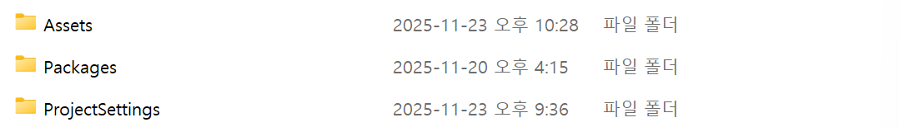

# 8번출구 기반으로 방탈출 게임 

---

## 1. 맵 구성 (논의 필요 항목)

* **테마:** S자 맵으로 구성. 테마 논의필요
* **구조:** 복도는 일자로 구성하고 때에 따라 작은 방이나 화장실 추가 (도구 습득처로 활용).

---

## 2. 스테이지 및 핵심 로직

### 2.1. 스테이지 목표
* 스테이지는 짧게 **4단계**로 구성 (게임 완성도 집중).
* 4 스테이지 중 **3번 이상**은 이상현상이 나오게 구성.

### 2.2. 핵심 로직
* **성공 조건:** 이상현상 발생 시 **해결 후 왔던 길로 돌아감** (다음 스테이지로 이동).
* **성공 조건:** 이상현상 미발생 시 **다음 스테이지로 이동** (앞으로 전진).
* **실패 조건:** 위 두 가지 조건을 어길 시 **1 스테이지로 강제 리셋** (앞으로 가면 스테이지 초기화).
* **이상현상 확률:** `random` 함수로 0~100 설정. **정상(미발생)** > **75** > **이상(발생)** 으로 구현.

---

## 3. 이상현상 및 연출

* **제한:** 이상현상은 스테이지당 **1개**로 제한. 한번 나왔던 이상현상은 다음 스테이지에 나오지않음( 초기화시 다시 나올수 있게 설정 )
* **해결 방식:** 이상현상 발생 시 도구를 습득하여 도구를 이용해 해결.
* **예시:**
* 
    * **창문 낙서:** '이 복도를 조심해' 등 공포감 조성 문구. 화장실 물수건으로 닦음 (상호작용 키로 일정 시간 누르고 있으면 해결). 해결 후 잠시 동안 창밖에 귀신 형상이 보이게 함.
    * **복도 그림:** 사물함 안의 쇠 지렛대를 이용해 그림 제거.
    * **없던 책:** 드럼통 안에 넣고 라이터로 태움.
    * **AI:** 움직이는 AI (에셋스토어에서 적절한 캐릭터 다운).
      
* **공포 연출:** 이상현상이 있으면 랜덤 시간을 부여해 귀신, 인형 등 공포감 조성 캐릭터가 잠시 동안 등장하는 것도 고려.
* **힌트:** 맵 곳곳(벽이나 책상 위, 이상현상 근처)에 힌트가 될만한 메모 부착. ( 낙서가 있다면 낙서가 위험해보여. 같이 힌트를 주는것 고려 ) 힌트로 이상현상유무를 판단할수 있으므로 이상현상 발생, 미발생 둘다 메모 배치
---

## 4. 플레이어 구성

* **시점:** 플레이어는 **1인칭**으로 진행.
* **도구 제한:** 습득할 수 있는 장비는 **1개**로 제한.
* **초기 구성:** 초기 도구는 1~2개로 구성하고 늘려가는 방식으로 진행.

---

## 5. 구현해야 하는 항목 

### 5.1. 💻 코드
* PlayerMovement.cs.cs - 플레이어의 움직임, 소리 연동 **(구현)**
* PlayerInventory.cs - 플레이어의 도구 사용 로직 **(구현)** + Tools.cs, ToolsType.cs로 사용 도구 관리
* 
* StageEndTrigger.cs - 씬 이동: 스테이지 간 이동 (성공 시 다음 스테이지, 실패 시 1 스테이지로 이동) 
* GameManager.cs - 씬 데이터 유지
* AnomalyManager.cs -   확률 기반 변칙 생성 (난수 생성 관리) **(구현)**
* StageEndTrigger.cs - 스테이지 성공/실패 판정 로직
* UISettings.cs - UI 관련 작업
* AnomalyObject.cs - 변수에 부착하여 이상현상 부여, 이상현상 물체 해결 확인
* 환경 연출 (귀신 등장 로직) **(일부 구현)** - 이상현상 해결/실패시 실행되는 연출 구현 필요
* 
**전체적인 틀이므로 진행시 수정, 추가 , 삭제해 코드 안정화 필요**
  
### 5.2. 🗺️ 맵 구성
* 에셋 이용해 맵 구조, 컨셉 확정하기
* 플레이어 캐릭터 확정

### 5.3. 🖥️ UI 
* 시작 화면
    * 플레이 버튼, 설정 버튼
* 엔딩 화면
* 설정 화면 (ESC 눌렀을 때 밝기, 소리 조절)
 이렇게 3가지만 복사해서 업로드해주시면 될거같습니다. 

++ 추가한 에셋이나 프리팹, 코드만 올려도 될거같습니다.

**이상현상 구현 물체 empty object에 AnomalyManager 연결**

**이상현상 물체에 AnomalyObject 연결 후 / 인스펙터에서 이상 현상 물체를 Element 추가 해야합니다**

**이상현상 발생시 랜덤으로 1가지 이상현상 발생, 그 외 이상현상은 숨김처리 되어있음.**

**숨김처리 되어있는 물체 공간이 투명벽처럼 막힐때 - SetActive(false) 사용**

